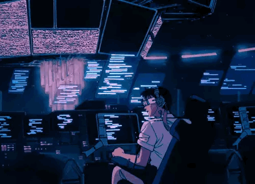

  

  
  

  

---

## 👋 About Me

I build systems that **watch, analyze, and respond** — security, AI, and real-world data flows.

- 📍 Based in Mumbai, India  
- 🛠️ Focus: Electron apps, Node.js backends, YOLO + speech recognition, Flutter  
- 🎯 Goal: Build things that notice when reality lies

---

## 🧰 Tech Stack

  

  

  

---

## 📊 GitHub Stats

  

  
  

  
  

  

---

## 🐍 Contribution Snake

  

---

## 🔭 Projects

| Project | Description |
|---------|-------------|
| **security-system** | Multi-person detection, audio analysis, realtime logging (YOLO + speech) |
| **Gods-Eye** | Hazard detection in Electron shell + Python inference server |
| **Mumbai-Hacks** | Backend + fact-checking routes (API-first) |
| **MISINFORMATION-GAME** | RPG that punishes bad info choices |
| **MoDoNER** | Flutter desktop: NER workflows (WIP) |

---

  

  

  
  
  

